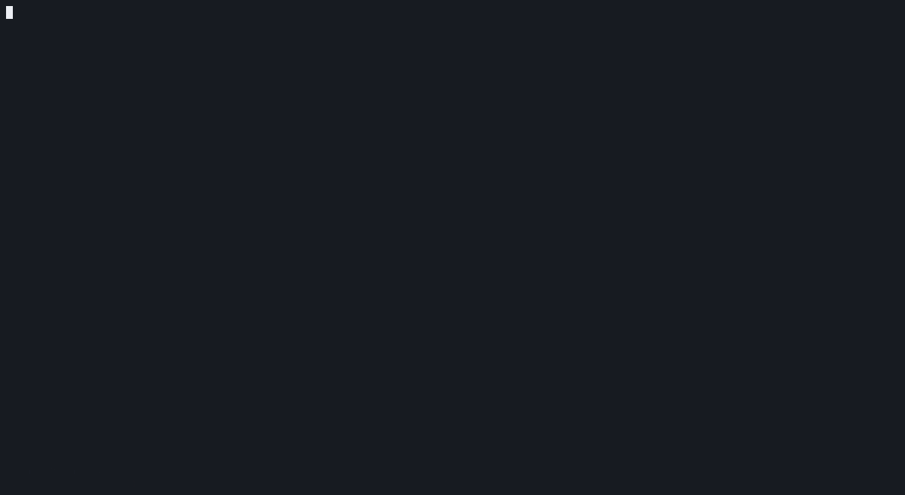

# nsq — NeuroSquad in your terminal

[](https://github.com/glmn-ai/neurosquad-cli/actions/workflows/ci.yml)
[](https://www.npmjs.com/package/neurosquad)
[](LICENSE)


Run several AI coding agents from one terminal.

`nsq` starts Claude Code, Codex, OpenCode or any command, keeps them running in a background
daemon, shows them as live terminals in one dashboard, and tells you when one of them is waiting for you,
including the question it is asking. You can answer from the dashboard.



> **0.1.0 is a preview.** Commands, keys and config may still change before 1.0. Please [report what breaks](https://github.com/glmn-ai/neurosquad-cli/issues).

## Install

Requires [Node.js](https://nodejs.org) 22.13 or newer. No compiler needed: native parts ship
prebuilt for Windows (x64, arm64), macOS (Apple silicon, Intel) and Linux (x64, arm64).

```sh
npm install -g neurosquad      # then run: nsq
npx neurosquad                 # or try it without installing
```

More ways (Homebrew, Scoop, install scripts) and uninstalling:
[docs/guide/getting-started.md](docs/guide/getting-started.md).

## Quick start

```sh
cd ~/code/my-app
nsq run claude "fix the flaky checkout test" --worktree   # an agent on its own branch
nsq run codex --name reviewer                             # a second agent
nsq run -- npm run dev                                    # any command, as an agent
nsq                                                       # the dashboard
```

In the dashboard, select an agent with the arrows, press **Enter** to work in it full screen, and
**Ctrl+]** to go back to the grid. When an agent asks a permission question, press **y**, **a** or
**n** without opening it. Press **q** to close the dashboard — the agents keep running.

## What it does

- **Agents that outlive the window.** A per-user daemon owns the terminals. Close the dashboard or
  the terminal — the agents keep working. `nsq down` stops them; the next `nsq up` (or just `nsq`)
  brings them back on their own sessions — after a reboot too.
- **One dashboard.** Workspaces and agents in a sidebar, the selected workspace as a grid of live
  terminals; any agent opens full screen and goes back to the grid.
- **Exact status, with the question.** Working / **needs you** / finished comes from each CLI's own
  hooks, not from guessing at the screen. "Needs you" carries the harness's own text, e.g.
  _Claude wants to run: npm test_.
- **Answer inline.** `y` / `a` / `n` (yes / always / no) on a permission prompt, `i` to interrupt,
  `s` to send a prompt — or `S` to send it when the current turn ends.
- **Notifications and sound.** A native notification on Windows, macOS and Linux when an agent
  needs you or finishes — one per agent, withdrawn when it works again. Over SSH or without a
  desktop, the dashboard rings its own terminal instead (bell + OSC 9).
- **A git worktree per agent.** `--worktree` gives the agent its own checkout on branch
  `nsq/<name>`, so parallel agents don't trip over each other. `nsq diff <agent>` shows its
  uncommitted changes.
- **Cost per agent.** `nsq cost` reads tokens from each harness's own logs. A model without a known
  price shows "no price", never $0.
- **Your config stays yours.** `~/.claude`, `~/.codex` and `opencode.json` are never written:
  everything nsq needs lives in a per-agent layer (flags, environment, its own folder).
- **OpenRouter built in.** One key, any model, for Claude Code, Codex and OpenCode.
- **Voice dictation.** Local speech recognition; the text is pasted into the agent, never sent.
- **Phone (experimental).** Pair a phone with a QR code and answer your agents from it.
- **Terminal graphics.** CLI logos over kitty / iTerm2 / sixel graphics, light
  animations that switch off over SSH and on request, ASCII fallbacks.

Supported: **Claude Code**, **Codex**, **OpenCode** (1.x and 2.x), and **any command**
(`nsq run -- <command>`; it has no hooks, so it shows working / finished, never "needs you").
Want another CLI? [Request it](https://github.com/glmn-ai/neurosquad-cli/issues/new?template=harness_request.yml).

## Keys

| Key                    | In the dashboard                                                   |
| ---------------------- | ------------------------------------------------------------------ |
| ↑ ↓ ← → / h j k l, Tab | select an agent (Tab walks all workspaces)                         |
| Enter, double-click    | open the agent full screen — every key goes to it; **Ctrl+]** back |
| y / a / n              | answer a permission prompt: yes / always / no                      |
| s / S                  | send a prompt / send it when the current turn is done              |
| c                      | start an agent (harness, name, prompt, folder, worktree, model…)   |
| i · x · X              | interrupt · stop · remove                                          |
| r · R · d              | restart (resumes the session) · rename · dangerous mode on/off     |
| m                      | pick a model (OpenRouter's catalogue)                              |
| v                      | dictate into the agent (also a global hotkey) — pasted, never sent |
| p                      | phones: who is connected                                           |
| [ ] · b · ? · q        | page of tiles · sidebar · help · quit (agents keep running)        |

The mouse works too: click selects, double-click opens, the wheel moves the selection.

## Commands

```text
nsq                                   the dashboard (starts the daemon)
nsq run <claude|codex|opencode> [prompt]
        [--name n] [--worktree] [--model id] [--provider openrouter] [--dangerous] [--attach]
nsq run [--name n] -- <command…>      any command
nsq ls [--json]                       agents and their status
nsq attach <agent>                    full-screen terminal (Ctrl+] to detach)
nsq send <agent> "prompt" [--when-done]
nsq answer <agent> yes|always|no      answer a permission prompt
nsq interrupt|stop|start|restart <agent>
nsq rm <agent> [--worktree]           remove (and delete its worktree)
nsq set <agent> [--dangerous on|off] [--model id|none] [--provider openrouter|none]
nsq diff <agent>                      uncommitted changes (git diff HEAD) in its folder
nsq peek <agent> [-n 20]              the last lines of its screen
nsq cost [--since 7d] [--json]        what each agent spent
nsq openrouter set-key|clear-key|models [query]|status
nsq phone on [--lan] [--port n]|off|pair|rotate|status
                                      answer agents from a phone
nsq phone push ntfy [url] [--token t]|off|test|show|status
                                      push "needs you" to the phone
nsq login | logout | whoami           the optional NeuroSquad account
nsq dictation setup|status|test <wav> [--model id]
nsq up | down                         start / stop the daemon (and its agents)
nsq doctor                            check harnesses, hooks, terminal
```

Everything you can do in the dashboard you can also script: `nsq ls --json`, `nsq send`,
`nsq answer`.

## OpenRouter

```sh
nsq openrouter set-key                 # stored in the OS keyring (or set OPENROUTER_API_KEY)
nsq run claude --provider openrouter --model anthropic/claude-sonnet-4.5
nsq openrouter models qwen             # search the catalogue
```

The key only ever goes into the agent's environment — never argv, logs or files. Requests carry
NeuroSquad's OpenRouter app attribution headers. Without a key, an agent runs on its CLI's own
login. Details: [docs/guide/openrouter.md](docs/guide/openrouter.md).

## Phone (experimental)

```sh
nsq phone on --lan     # off by default; without --lan it listens on this machine only
nsq phone pair         # prints the link and a QR code — scan it with the phone
nsq phone push ntfy    # optional: a push via ntfy when an agent needs you
```

From the phone you can see the agents and their screens, send a prompt, answer a permission
prompt and interrupt. A phone cannot start agents, change settings or type arbitrary keys. The
link carries the pairing token — treat it like a password; `nsq phone rotate` signs every phone
out. Pushes through [ntfy](https://ntfy.sh) carry only the agent's name and its question. This
part is the newest and most likely to change: [docs/guide/phone.md](docs/guide/phone.md).

## Voice dictation

Press **v** in the dashboard (or the global hotkey, `Ctrl+Shift+Space` / `Cmd+Shift+Space` by
default) and speak: the text is recognised **on your machine** and pasted into the agent's input.
It is never submitted — you press Enter. The speech model (~670 MB, checked by SHA-256) is
downloaded once — with `nsq dictation setup`, or when you first press **v**. Not available on
Windows arm64.
[docs/guide/dictation.md](docs/guide/dictation.md).

## Privacy

- **No account required.** Everything works without signing in.
- **No telemetry.** nsq does not report usage anywhere.
- Data lives in `~/.neurosquad-cli` (move it with `NSQ_HOME`). Secrets (the OpenRouter key, the
  ntfy topic and token, the optional account session) live in the OS keyring.
- Network access is what you ask for: your agents' own traffic, OpenRouter if you use it, the
  one-time dictation model download, ntfy if you turn it on, and the NeuroSquad account if you
  sign in.

## Platforms

Windows 10/11 (x64, arm64), macOS (Apple silicon, Intel), Linux (x64, arm64), each checked in CI
from the packed npm package on Node 22 and 24. Works over SSH: the daemon runs wherever you run
`nsq`, and notifications fall back to the terminal.

## Documentation

[Getting started](docs/guide/getting-started.md) ·
[Dashboard and keys](docs/guide/dashboard.md) ·
[Agents and harnesses](docs/guide/agents.md) ·
[OpenRouter](docs/guide/openrouter.md) ·
[Worktrees](docs/guide/worktrees.md) ·
[Notifications](docs/guide/notifications.md) ·
[Phone](docs/guide/phone.md) ·
[Dictation](docs/guide/dictation.md) ·
[Configuration](docs/guide/configuration.md) ·
[Troubleshooting](docs/guide/troubleshooting.md) ·
[Uninstall](docs/guide/uninstall.md)

How it works inside: [harness integrations](docs/harnesses.md), [agent status](docs/status.md).

## nsq and the NeuroSquad desktop app

nsq is the open-source, terminal sibling of [NeuroSquad](https://neurosquad.ai), a desktop app where
agents are cards with live terminals on a canvas: 20+ CLIs, agents that talk to each other by
arrows, browser/notes/plugin cards, recording. Both share the same open-source integration core,
[`@neurosquad/core`](packages/core). Use nsq when you live in the terminal, work over SSH or on
Linux servers, or want something small and open; use the desktop app when you want the canvas.

## Contributing

Contributions are welcome — every change goes through a pull request. Read
[CONTRIBUTING.md](CONTRIBUTING.md) and the [Code of Conduct](CODE_OF_CONDUCT.md). Security issues:
[SECURITY.md](SECURITY.md). Questions and ideas:
[Discussions](https://github.com/glmn-ai/neurosquad-cli/discussions) or our
[Discord](https://discord.gg/DyKn8cGTc). Releases: [RELEASING.md](RELEASING.md).

## Trademarks

Claude Code, Codex, OpenCode and their logos are trademarks of their respective owners. nsq shows
them only to identify which CLI an agent runs; this does not imply endorsement of or affiliation
with NeuroSquad. Prefer no third-party marks? Set `NSQ_LOGOS=none` for neutral badges.

## License

[MIT](LICENSE) © 2026 Stanislav Gelman and NeuroSquad contributors
