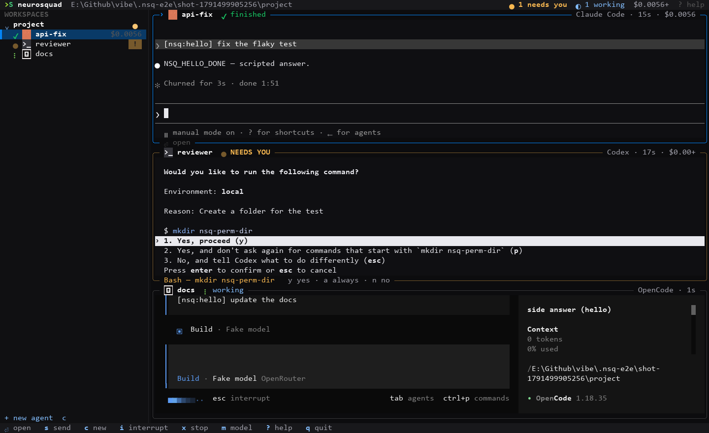

# The dashboard

`nsq` with no arguments opens the dashboard: the workspaces and their agents in a sidebar on the
left, the agents of the selected workspace as a grid of live terminals on the right. Any agent opens
full screen and goes back to the grid.

| Key                    |                                                                                             |
| ---------------------- | ------------------------------------------------------------------------------------------- |
| ↑ ↓ ← → / h j k l, Tab | select an agent (Tab walks all workspaces)                                                  |
| Enter, double-click    | open the agent full screen — every key goes to it; **Ctrl+]** back to the grid              |
| y / a / n              | answer the selected agent's permission prompt (yes / always / no)                           |
| s / S                  | send a prompt / send it when the current turn is done                                       |
| c                      | start an agent (harness, name, prompt, folder, worktree, OpenRouter, model, dangerous mode) |
| m                      | pick a model (OpenRouter's catalogue)                                                       |
| i · x · X · r · R · d  | interrupt · stop · remove · restart · rename · dangerous mode                               |
| v                      | dictate into the agent (also the global hotkey); the text is pasted, never sent             |
| [ ] · b · ? · q        | page of tiles · sidebar · help · quit (agents keep running)                                 |

The mouse works too: click selects, double-click opens, the wheel moves the selection; in a full
screen agent that asked for the mouse, clicks go to it.

## How it draws

- **Tiles** are `@neurosquad/term-view`: one headless terminal per agent, fed with the daemon's
  output (`owner: false` — the daemon's own copy answers the agents' terminal queries), painted into
  its rectangle by one compositor that sends only changed cells.
- **Chrome** (header, sidebar, frames, dialogs) is a cell canvas written as a diff against the
  previous frame; cells that belong to a tile are never touched, so nothing is cleared and nothing
  flickers. Colours, glyphs, logos and animations come from `@neurosquad/tui-theme`.
- One frame at most every ~33 ms, only when something changed. Decorative animation (working
  spinner, needs-you pulse, finish sparkle) runs on the theme's single ticker and pauses while an
  agent is open full screen and when the terminal loses focus; `NSQ_NO_ANIMATION=1` turns it off.
- Each visible agent's terminal takes its tile's size (debounced; the most recent client wins); the
  open agent takes the whole area.
- Logos: real images over kitty / iTerm2 / sixel where the terminal has them, two-cell glyph badges
  elsewhere, neutral badges with `NSQ_LOGOS=none` (or `"logos": "neutral"` in `config.json`).

## Why not a TUI framework

Measured on Windows 10 under ConPTY (the path Windows Terminal uses), 9 live tiles fed with
agent-like output, 200 × 50 cells, 30 fps, 8 seconds:

| Renderer                      | frame time avg / p95 | CPU in 8 s | memory | bytes to the terminal |
| ----------------------------- | -------------------- | ---------- | ------ | --------------------- |
| own cell diff (chosen)        | 1.2 / 1.9 ms         | 0.39 s     | 84 MB  | 1.4 MB                |
| OpenTUI (`@opentui/core` 0.5) | 6.1 / 10.2 ms        | 1.9 s      | 90 MB  | 4.2 MB                |
| Ink 8 (React)                 | 39 / 71 ms           | 8.5 s      | 267 MB | 1.7 MB                |

Ink re-renders the whole tree and pinned a CPU core; OpenTUI was fine but runs on Node only from
26.4 with `--experimental-ffi`, which an npm-installed CLI cannot rely on. Live terminals are cell
grids anyway, so the dashboard draws cells directly.
