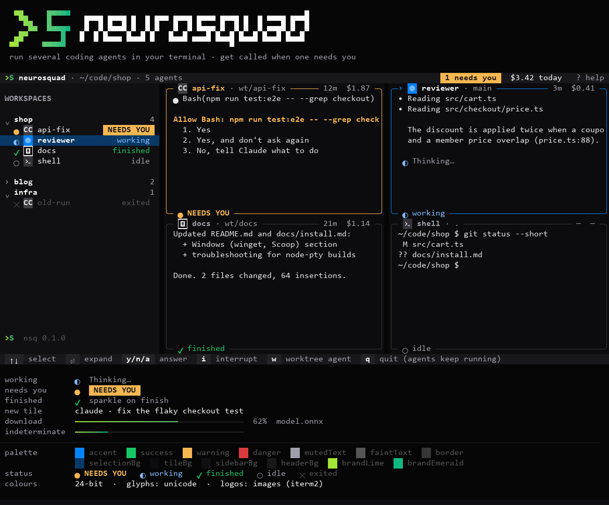
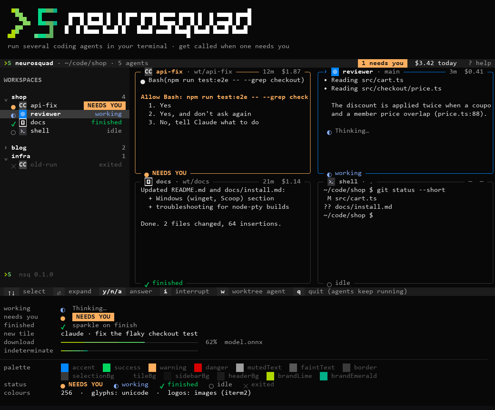
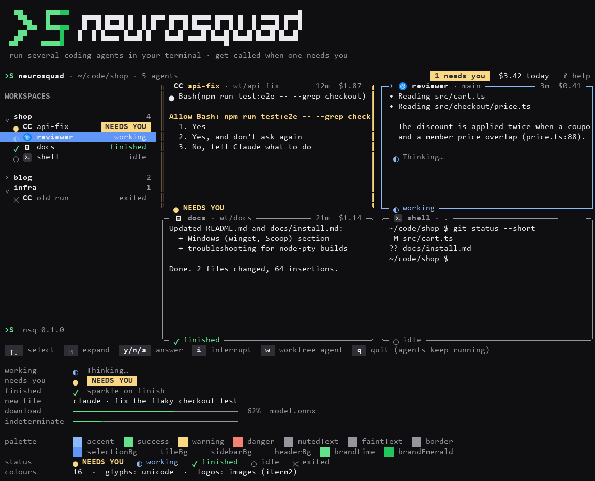
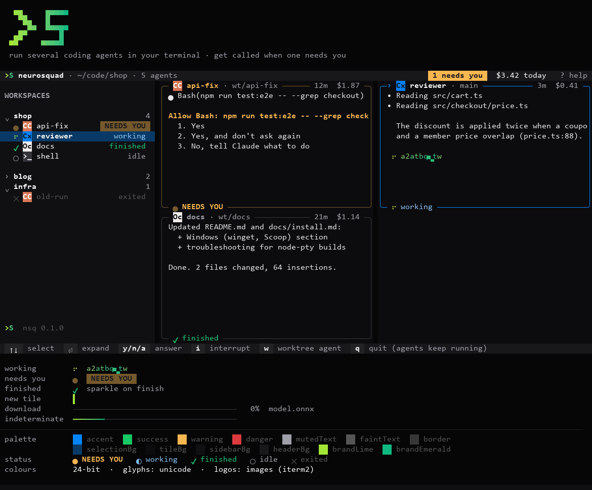

# @neurosquad/tui-theme

The NeuroSquad look for terminal UIs: the desktop app's dark palette with automatic downgrade to
256 / 16 colours, status colours and glyphs, rounded tile frames, the `>S` wordmark, harness logos
(real images over kitty / iTerm2 / sixel, or two-cell glyph badges) and a set of small animations
driven by one shared ticker.

It is **framework-agnostic**: plain RGB / ANSI values, a tiny styled-text model (`Line = Seg[]`)
and pure frame generators. Ink, OpenTUI or a raw ANSI writer can all consume it. No runtime
dependencies.



| 256 colours                          | 16 colours                         |
| ------------------------------------ | ---------------------------------- |
|  |  |

Effects (truecolor, recorded from `npm run preview -w packages/tui-theme -- --live`):



## Preview

```sh
npm run preview -w packages/tui-theme                      # static demo, detected terminal
npm run preview -w packages/tui-theme -- --live            # every effect animated (q to quit)
npm run preview -w packages/tui-theme -- --colors=256      # truecolor | 256 | 16 | none
npm run preview -w packages/tui-theme -- --logos=glyphs    # images | glyphs | none
npm run preview -w packages/tui-theme -- --graphics=kitty  # force kitty | iterm2 | sixel
```

## Using it

```ts
import {
  createTheme, frame, renderLine, seg, logoBadge, borderChars, openTuiBorderChars, animations
} from '@neurosquad/tui-theme'

const theme = createTheme() // detects colour depth, Unicode, logo mode from the environment

// Raw ANSI
process.stdout.write(theme.paint(' NEEDS YOU ', { fg: 'warningFg', bg: 'needsYou', bold: true }))

// Ink: every role has a value Ink's `color` accepts at this terminal's depth
// (hex at 24-bit, `ansi256(n)` at 256, a chalk name at 16, undefined = terminal default)
<Text color={theme.colors.accent.ink}>working</Text>
<Box borderStyle={borderChars('rounded')} borderColor={theme.colors.focusBorder.ink} />

// OpenTUI
<box borderStyle="rounded" customBorderChars={openTuiBorderChars('rounded')}
     borderColor={theme.colors.focusBorder.hex} backgroundColor={theme.colors.tileBg.hex} />

// Anything that renders a `Line` (Seg = text + fg/bg/bold…): tiles, header, wordmark, effects
for (const line of frame(theme, { width: 60, height: 12, state: 'focused', title: [...logoBadge(theme, 'codex'), seg(' reviewer')] }))
  console.log(renderLine(theme, line))
```

### What is in the box

| Module         | What                                                                                                                                                                                                                                                                                                                                                                                                                                                |
| -------------- | --------------------------------------------------------------------------------------------------------------------------------------------------------------------------------------------------------------------------------------------------------------------------------------------------------------------------------------------------------------------------------------------------------------------------------------------------- |
| `tokens`       | Source values: HeroUI v3 dark tokens (`--background`, `--surface`, `--accent`, …), the agent cards' `TERMINAL_THEME`, `EDGE_ACCENT`, the brand gradient (lime `#a3e635` → emerald `#10b981`), and `ROLE_SOURCES` — the semantic roles (`appBg`, `sidebarBg`, `tileBg`, `headerBg`, `text`, `mutedText`, `faintText`, `border`, `focusBorder`, `accent`, `selectionBg`, `success`, `warning`, `danger`, `needsYou`, `needsYouGlow`, `brandLime`, …). |
| `theme`        | `createTheme()` → every role resolved as `{ hex, rgb, ansi256, ansi16, ink, fg, bg }`; `paint`, `open`.                                                                                                                                                                                                                                                                                                                                             |
| `color`        | OKLCH → sRGB, OKLab mixing, gradients, WCAG contrast, 256-colour and 16-colour downgrade.                                                                                                                                                                                                                                                                                                                                                           |
| `capabilities` | Colour depth, Unicode, ambiguous width, inline-image support (env + optional probe).                                                                                                                                                                                                                                                                                                                                                                |
| `glyphs`       | The five statuses (`needs-input`, `working`, `finished`, `idle`, `exited`): glyph + label + role, Unicode and ASCII sets, spinner frames.                                                                                                                                                                                                                                                                                                           |
| `borders`      | Border sets in Ink and OpenTUI shapes; `frame()` (tile with title, right title, footer, body), `statusLine`, `keyHint`, `badge`, `rule`.                                                                                                                                                                                                                                                                                                            |
| `wordmark`     | The `>S neurosquad` lockup as half-block pixel art with the brand gradient; `compactMark()` for headers.                                                                                                                                                                                                                                                                                                                                            |
| `logos`        | Harness registry, glyph badges, embedded 16/32 px PNGs, kitty / iTerm2 / sixel encoders.                                                                                                                                                                                                                                                                                                                                                            |
| `text`         | `Line`/`Seg`, `renderLine`, `fitLine`, `hjoin`, `overlay`, `sliceLine`, `diffFrames`.                                                                                                                                                                                                                                                                                                                                                               |
| `width`        | Grapheme-aware cell width (East Asian wide, emoji, ZWJ, VS16, combining marks), `truncate`, `fit`.                                                                                                                                                                                                                                                                                                                                                  |
| `animations`   | `Ticker`, `resolveMotion`, `WriteLatencyMeter` and the effects below.                                                                                                                                                                                                                                                                                                                                                                               |

### Colour depth

Detected in this order: `NSQ_COLOR=truecolor|256|16|none` (ours, wins) → `FORCE_COLOR` (0–3) →
`NO_COLOR` (no colour) → not a TTY / `TERM=dumb` (no colour) → `COLORTERM=truecolor|24bit`, known
truecolor terminals (kitty, Ghostty, WezTerm, iTerm2, VS Code, Windows Terminal, Alacritty, foot…)
and Windows 10 conhost build ≥ 14931 → 24-bit; `*-256color` → 256; other colour `TERM`s → 16.

At 16 colours a role maps to the ANSI colour with the same **meaning** (accent → bright blue,
needs-you → bright yellow…), not to the nearest xterm RGB value, because terminal themes re-paint
those 16 colours. Backgrounds fall back to the terminal's default.

**Status is never colour-only**: each state has its own glyph and label (`● NEEDS YOU`,
`◐ working`, `✔ finished`, `○ idle`, `✕ exited`; ASCII `! * + - x`), and at ≤ 16 colours the
focused tile switches to a heavy border and a needs-you tile to a double one.

### Glyph widths

Every glyph we draw is one cell and has no emoji presentation, so it never turns into a two-cell
colour emoji (tested). Box drawing, `●` and blocks are East Asian _ambiguous_: CJK terminals set to
"ambiguous = wide" draw them two cells wide and every border breaks. Set `NSQ_AMBIGUOUS_WIDE=1`
there — the theme switches to the ASCII set. `NSQ_GLYPHS=ascii|unicode` forces either set.

### Harness logos

`logos: "images" | "glyphs" | "none"` (option of `createTheme`, env `NSQ_LOGOS`):

- `images` — the real logo through a terminal graphics protocol when the terminal has one, else
  the glyph badge (Claude Code has no image: it always gets its glyph badge);
- `glyphs` — a two-cell badge: the monogram (`Cx`, `Oc`, `>_`) on the brand colour; Claude Code is
  a neutral `CC` (light grey on dark grey, no brand colour);
- `none` — the same badge on a neutral chip, no brand marks or colours at all.

Image support: `detectGraphicsFromEnv(env)` knows kitty and Ghostty (kitty protocol), iTerm2 and
WezTerm (iTerm2 protocol), foot and mlterm (sixel), and says `source: 'unknown'` where only the
terminal can tell (Windows Terminal ≥ 1.22, VS Code, Konsole, xterm). For those, call
`queryGraphics(stdin, stdout)` **without awaiting it before the first frame**: it sends a kitty
query, a cell-size query and Device Attributes, resolves on the DA reply or after 150 ms, never
throws, and hands back any keystrokes that arrived meanwhile in `rest`. Inside tmux images are off
unless you pass `tmuxPassthrough: true` (needs `set -g allow-passthrough on`); kitty's protocol is
never used through tmux. GNU screen and zellij: off. `NSQ_IMAGES=0`: off.

Drawing: render the badge cells as usual, then write `placeAt(row, col, logoImage(id, { protocol }))`
after the frame. kitty (`C=1`) and iTerm2 (`doNotMoveCursor`) leave the cursor alone; sixel is
wrapped in save/restore by `placeAt`. Pass a kitty `id` to replace an image in place, and
`kittyDelete()` before tearing the screen down.

Adding a harness: an entry in `HARNESS_LOGOS` (`src/logos.ts`) — it immediately gets a glyph badge
— plus its icon in the source folder of `scripts/gen-logos.py` for the PNGs
(`python scripts/gen-logos.py <icons dir>`, needs Pillow). Without PNGs, `logoImage` returns
`undefined` and the glyph badge stays.

### Animations

Pure frame generators over one shared clock. Effects only decorate **our** chrome — borders,
labels, badges, the sidebar. Never run them over an agent's terminal content.

| Effect                                                                   | Use                                                                                                                                        |
| ------------------------------------------------------------------------ | ------------------------------------------------------------------------------------------------------------------------------------------ |
| `spinner(theme, now)`                                                    | "working": braille frames, colour breathing along the brand gradient                                                                       |
| `thinking(theme, 'Thinking…', now, { startedAt })`                       | decodes out of scrambled glyphs, then a soft shimmer glides across                                                                         |
| `attentionPulse(now, since)` / `attentionBadge` / `attentionDot`         | **needs you**: three quick strong beats, then a slow shallow breath; drive a tile's `frame({ borderColor })` and the sidebar badge with it |
| `tileEnter(theme, now, startedAt, frameOptions)`, `fadeIn`, `typewriter` | a new tile fades in; a new title types itself                                                                                              |
| `wordmarkSweep(theme, now, startedAt)`                                   | the splash: a light band sweeps across `>S neurosquad` in 850 ms                                                                           |
| `progressBar(theme, now, { width, ratio })`                              | gradient bar for downloads (indeterminate when `ratio` is undefined)                                                                       |
| `sparkle(theme, now, finishedAt)`                                        | a 700 ms twinkle on the status glyph when an agent finishes                                                                                |
| `transitionRect(now, startedAt, from, to)`                               | expand-to-fullscreen / back-to-grid: a box growing over ~180 ms; re-layout the terminal once, at the end                                   |

Rules the lead TUI should keep (the package gives you the pieces):

- **One clock.** Subscribe effects to `animations.sharedTicker` (12 fps decorative, 30 fps for
  transitions). It runs a single interval only while someone listens; never a timer per tile.
- **Pause** with `ticker.pause('hidden' | 'background' | 'attached')` and `resume` — e.g. while an
  agent is attached full-screen, or the terminal reports focus-out.
- **Policy.** `resolveMotion({ colorLevel: theme.level, reduceMotion })` → `animate: false` for
  `NSQ_NO_ANIMATION=1`, the `reduceMotion` setting, ≤ 16 colours / `NO_COLOR`, and SSH sessions
  (`NSQ_ANIMATION=1` forces it on). Feed writes through `WriteLatencyMeter` and call
  `ticker.setEnabled(false)` when it says `slow`.
- **Static frames.** Every effect called with `now = undefined` returns its resting frame — that is
  what the TUI shows when motion is off.
- **Repaint only what changed.** Colours are quantised so consecutive frames are often identical;
  `diffFrames(prev, next)` gives the changed cell spans for a raw writer. With Ink, keep each
  animated piece in its own small component.

## Trademarks

Claude Code, Codex and OpenCode are trademarks of their respective owners. Their names are used
only to describe which CLI an agent runs; this does not imply any partnership with, endorsement
of, or affiliation with NeuroSquad or nsq.

- **Claude Code** is shown with a neutral `CC` glyph (light grey on dark grey), at Anthropic's
  request: this package ships no Claude Code logo, image or brand colour.
- The Codex and OpenCode icons shipped here only identify those CLIs; we remove one if its owner asks.
- The `command` icon and the `>S` mark are ours.

Users and redistributors who prefer no third-party icons or brand colours can set
`logos: "none"` (`NSQ_LOGOS=none`): every harness then gets its two-letter monogram on a neutral
chip.

## Maintainer scripts

- `scripts/gen-logos.py <icons dir>` — logo PNGs + `src/logos.generated.ts` (Pillow).
- `scripts/gen-east-asian-width.py > src/eastAsianWidth.generated.ts` — width tables from Python's
  `unicodedata`.
- `scripts/term-dump.mjs` + `scripts/render-frames.py` — the screenshots above: preview output (or
  an asciinema cast from `--record=demo.cast`) is replayed through `@xterm/headless`; iTerm2 image
  escapes are placed as the real PNGs; Pillow draws the PNG / GIF.

## License

MIT
